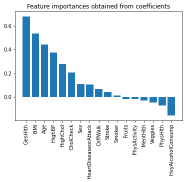

# Capstone Project
### Group 10

#### Members:
Areej Fatima.  
Chao Qun S.  
Julia G.  
Miguel F.  

### Project Idea

We are creating a supervised machine learning model to predict if a client would have diabetes given the data. The files were downloaded from https://www.kaggle.com/datasets/prosperchuks/health-dataset?select=diabetes_data.csv.

### Machine Learning Model

### Dasboard
https://public.tableau.com/app/profile/areej7838/viz/Diabetes_16753024580310/Dashboard1

### Data Exploration

According to the data, GenHlth, BMI, Age, HighBP, and CholCheck are the features that have a bigger affect on the outcome of predicting diabetes in a patient.

Interestingly, heavy alcholol consumption has a negative correlation to predicting diabetes.

Five questions we plan to answer:

1. Can our ML model predict diabetes?
2. Does age increase the diabetes risk? (Binning by age / Bar graph)
3. Is there a correlation between BMI and diabetes onset?
4. Is one gender more likely to develop diabetes? 
5. Negative correlation - heavy consumers are less likely to develop diabetes?

